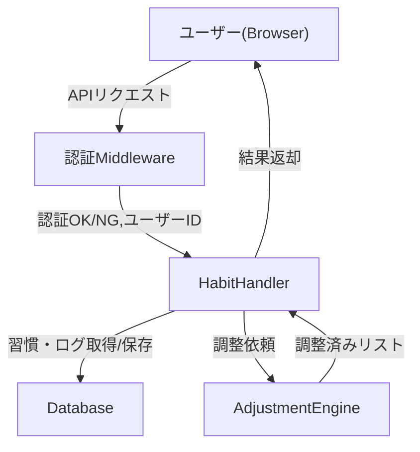

# アーキテクチャ概要

## システム全体像
本システムは「習慣クエスト」アプリケーションであり、ユーザーの習慣管理・コンディション管理・振り返り・統計・認証を提供します。

### 主な構成要素
- フロントエンド（ブラウザ）
- サーバー（API/ハンドラ）
- ミドルウェア（認証・セッション管理）
- 調整エンジン（習慣リスト調整ロジック）
- データベース

---

## コンポーネント構成

---

## 各コンポーネントの責務

### フロントエンド
- 習慣・コンディション入力、チェック、振り返りUI
- ログイン/ログアウト画面
- API経由でサーバーと通信

### 認証ミドルウェア
- セッション検証
- 未認証時はログイン画面を返却
- ログイン情報の検証・セッション発行

### ハンドラ（HabitHandler）
- ユーザーごとの習慣・実行ログ管理
- コンディション入力受付
- 調整エンジンへの依頼
- 結果をフロントエンドへ返却

### 調整エンジン（AdjustmentEngine）
- 習慣リスト調整ロジック
- コンディション・コスト・マスト性等に応じたリスト生成

### データベース
- ユーザー情報、習慣、実行ログ、セッション等の永続化

---

## シーケンス概要
- セッションが無い場合はログイン画面を表示し、認証成功後にユーザーIDを発行
- セッションが有効な場合はユーザーIDを取得し、前日の実行ログや習慣リストを取得
- コンディション入力後、調整エンジンで習慣リストを調整し返却
- 習慣チェックや振り返り、統計機能も同様にAPI経由で処理

---
