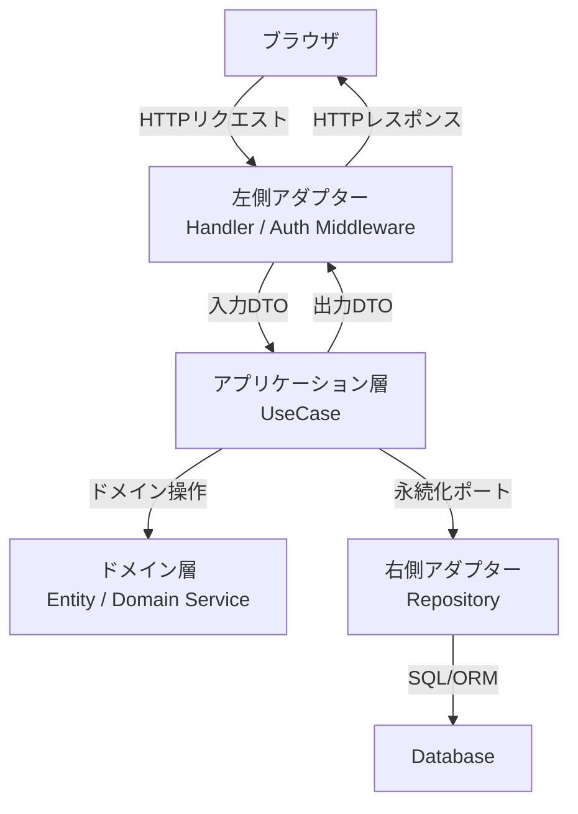

# アーキテクチャ概要

## システム全体像
本システムは「習慣クエスト」アプリケーションであり、ユーザーの習慣管理・コンディション管理・振り返り・統計・認証を提供します。
本システムのバックエンドは、ヘキサゴナルアーキテクチャを採用します。

### 主な構成要素
- 左側アダプター（HTTP/API、認証）
- アプリケーション層（ユースケース）
- ドメイン層（ビジネスルール）
- 右側アダプター（永続化、外部サービス）

---

## アーキテクチャ選定理由
### 優先したいこと
- テストを重視し、継続的に品質を担保したい
- 外部依存の実装を将来変更できる構造にしたい
- 学習コストを抑え、実装を早く立ち上げたい

### アーキテクチャ候補

#### ヘキサゴナルアーキテクチャ
- メリット
  - ビジネスロジックを疎結合に保ちやすい
  - ユニットテストを実施しやすい
- デメリット
  - インターフェース設計の分だけ実装量が増える
  - DIの考え方に慣れるまで学習コストがかかる

#### レイヤードアーキテクチャ
- メリット
  - 構造が単純明快で、実装に入りやすい
- デメリット
  - 層間の依存が広がりやすく、層単体でのテストが難しくなりやすい

#### クリーンアーキテクチャ
- メリット
  - ビジネスロジックの独立性を高く保てる
  - 保守運用に強く、変更耐性が高い
- デメリット
  - 学習コストが比較的大きい
  - 層ごとのデータ変換が増え、実装負荷が高くなりやすい

### ヘキサゴナルアーキテクチャを選んだ理由
- レイヤードアーキテクチャの実装容易性と、クリーンアーキテクチャの分離思想の中間を狙える点を重視した
- クリーンアーキテクチャほど厳密な分離を求めないため、初期の学習コストと実装コストを抑えられる
- ビジネスロジックを疎結合に保ちやすく、ユニットテストを導入しやすい
- 外部依存をアダプター層へ閉じ込めることで、将来的な技術変更に対応しやすい
- 結果として、現時点の開発速度と将来の保守性のバランスが最も良いと判断した

---

## コンポーネント構成

---

## 各コンポーネントの責務

### フロントエンド
- 習慣・コンディション入力、チェック、振り返りUI
- ログイン/ログアウト画面
- API経由でサーバーと通信

### 左側アダプター（HTTP/API、認証）
- HTTPリクエストを受け取り、入力を検証してユースケースへ渡す
- セッション検証、ログイン/ログアウト等の認証処理を担当する
- ユースケース結果をHTTPレスポンスへ変換する

### アプリケーション層（ユースケース）
- 機能ごとのユースケースを実行し、処理フローを制御する
- ドメイン層にビジネス判断を委譲する
- 永続化や外部連携はポート（インターフェース）経由で呼び出す

### ドメイン層（Entity/Domain Service）
- 習慣調整、連続記録、振り返り判定など中核ルールを保持する
- フレームワークやDB実装から独立する

### 右側アダプター（Repository、外部サービス）
- ポート実装としてDBアクセスや外部連携を提供する
- ドメイン/ユースケースの依存先として実装詳細を隠蔽する

---

## シーケンス概要
- セッションが無い場合はログイン画面を表示し、認証成功後にユーザーIDを発行
- セッションが有効な場合はユーザーIDを取得し、前日の実行ログや習慣リストを取得
- コンディション入力後、ユースケース経由でドメインロジックを実行し、調整済み習慣リストを返却
- 習慣チェックや振り返り、統計機能も同様にAPI経由で処理
