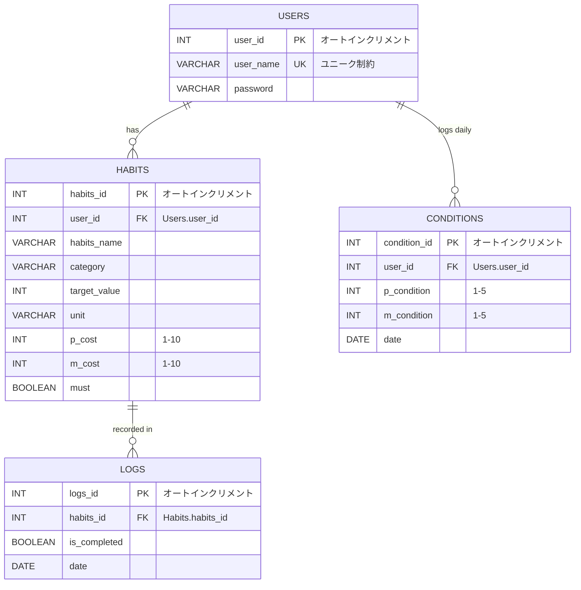

```mermaid
erDiagram

    USERS ||--o{ HABITS : "has"
    USERS ||--o{ CONDITIONS : "logs daily"
    HABITS ||--o{ LOGS : "recorded in"
           

    USERS {
        INT user_id PK "オートインクリメント"
        VARCHAR user_name UK "ユニーク制約"
        VARCHAR password ""
    }

    HABITS {
        INT habits_id PK "オートインクリメント"
        INT user_id FK "Users.user_id"
        VARCHAR habits_name
        VARCHAR category
        INT target_value
        VARCHAR unit
        INT p_cost "1-10"
        INT m_cost "1-10"
        BOOLEAN must
    }

    CONDITIONS {
        INT condition_id PK "オートインクリメント"
        INT user_id FK "Users.user_id"
        INT p_condition "1-5"
        INT m_condition "1-5"
        DATE date
    }

    LOGS {
        INT logs_id PK "オートインクリメント"
        INT habits_id FK "Habits.habits_id"
        BOOLEAN is_completed
        DATE date
    }
```
