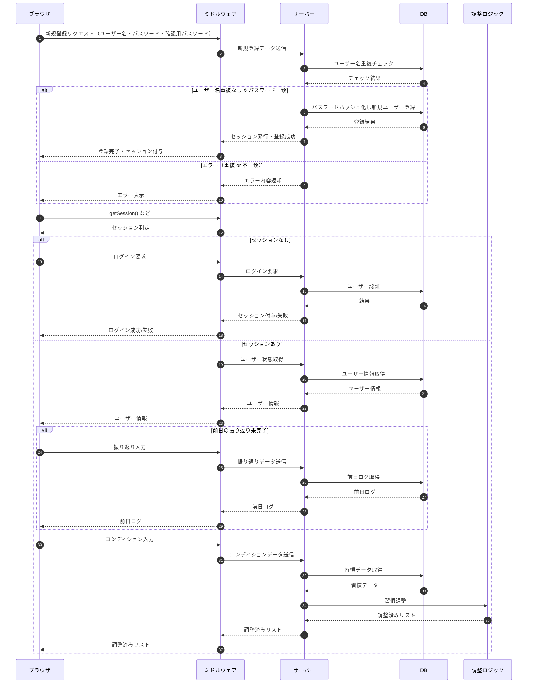

# シーケンス図

```mermaid
sequenceDiagram
    autonumber
    participant Browser as ブラウザ
    participant Middleware as ミドルウェア
    participant Server as サーバー
    participant DB as DB
    participant Engine as 調整ロジック

    %% ユーザー登録
    Browser->>Middleware: 新規登録リクエスト（ユーザー名・パスワード・確認用パスワード）
    Middleware->>Server: 新規登録データ送信
    Server->>DB: ユーザー名重複チェック
    DB-->>Server: チェック結果
    alt ユーザー名重複なし & パスワード一致
        Server->>DB: パスワードハッシュ化し新規ユーザー登録
        DB-->>Server: 登録結果
        Server-->>Middleware: セッション発行・登録成功
        Middleware-->>Browser: 登録完了・セッション付与
    else エラー（重複 or 不一致）
        Server-->>Middleware: エラー内容返却
        Middleware-->>Browser: エラー表示
    end

    %% セッション確認
    Browser->>Middleware: getSession() など
    Middleware->>Browser: セッション判定

    alt セッションなし
        Browser->>Middleware: ログイン要求
        Middleware->>Server: ログイン要求
        Server->>DB: ユーザー認証
        DB-->>Server: 結果
        Server-->>Middleware: セッション付与/失敗
        Middleware-->>Browser: ログイン成功/失敗
    else セッションあり
        Middleware->>Server: ユーザー状態取得
        Server->>DB: ユーザー情報取得
        DB-->>Server: ユーザー情報
        Server-->>Middleware: ユーザー情報
        Middleware-->>Browser: ユーザー情報

        alt 前日の振り返り未完了
            Browser->>Middleware: 振り返り入力
            Middleware->>Server: 振り返りデータ送信
            Server->>DB: 前日ログ取得
            DB-->>Server: 前日ログ
            Server-->>Middleware: 前日ログ
            Middleware-->>Browser: 前日ログ
        end

        %% 振り返り後または不要時は必ずコンディション入力
        Browser->>Middleware: コンディション入力
        Middleware->>Server: コンディションデータ送信
        Server->>DB: 習慣データ取得
        DB-->>Server: 習慣データ
        Server->>Engine: 習慣調整
        Engine-->>Server: 調整済みリスト
        Server-->>Middleware: 調整済みリスト
        Middleware-->>Browser: 調整済みリスト
    end
```
