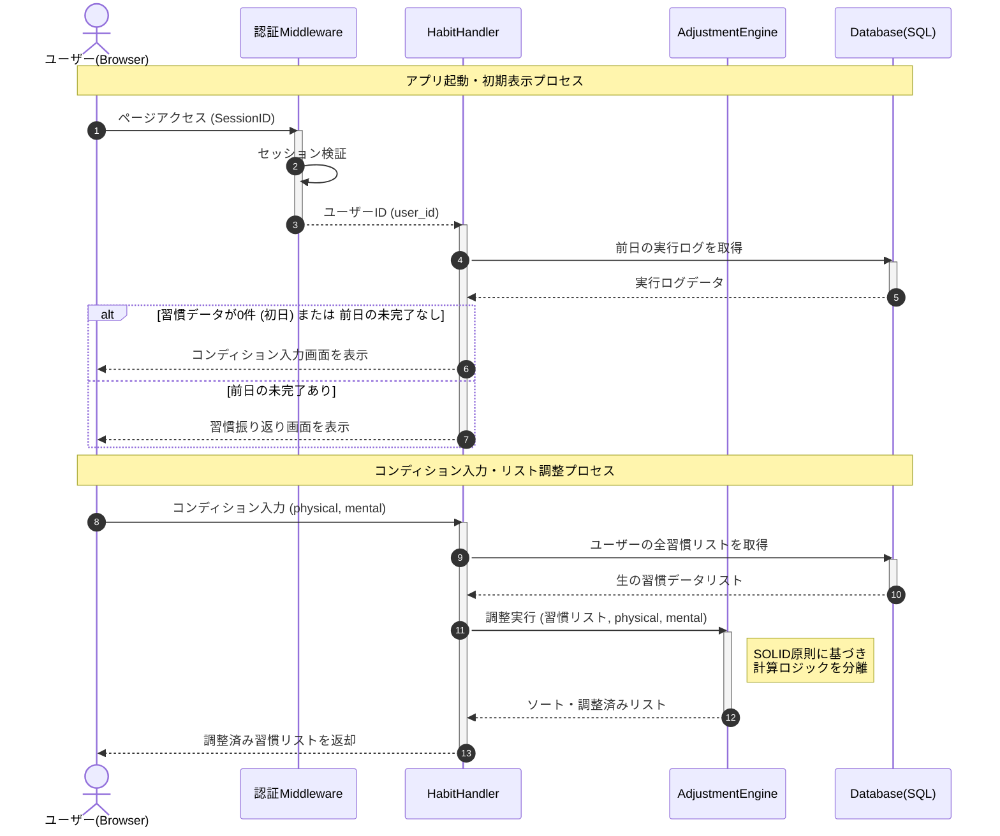

```mermaid
sequenceDiagram
    autonumber
    actor User as ユーザー(Browser)
    participant Auth as 認証Middleware
    participant Handler as HabitHandler
    participant Engine as AdjustmentEngine
    participant DB as Database(SQL)

    Note over User, DB: アプリ起動・初期表示プロセス

    User->>Auth: ページアクセス (SessionID)
    activate Auth
    Auth->>Auth: セッション検証
    Auth-->>Handler: ユーザーID (user_id)
    deactivate Auth
    
    activate Handler
    Handler->>DB: 前日の実行ログを取得
    activate DB
    DB-->>Handler: 実行ログデータ
    deactivate DB

    alt 習慣データが0件 (初日) または 前日の未完了なし
        Handler-->>User: コンディション入力画面を表示
    else 前日の未完了あり
        Handler-->>User: 習慣振り返り画面を表示
    end
    deactivate Handler

    Note over User, DB: コンディション入力・リスト調整プロセス

    User->>Handler: コンディション入力 (physical, mental)
    activate Handler
    Handler->>DB: ユーザーの全習慣リストを取得
    activate DB
    DB-->>Handler: 生の習慣データリスト
    deactivate DB

    Handler->>Engine: 調整実行 (習慣リスト, physical, mental)
    activate Engine
    Note right of Engine: SOLID原則に基づき<br/>計算ロジックを分離
    Engine-->>Handler: ソート・調整済みリスト
    deactivate Engine

    Handler-->>User: 調整済み習慣リストを返却
    deactivate Handler
```