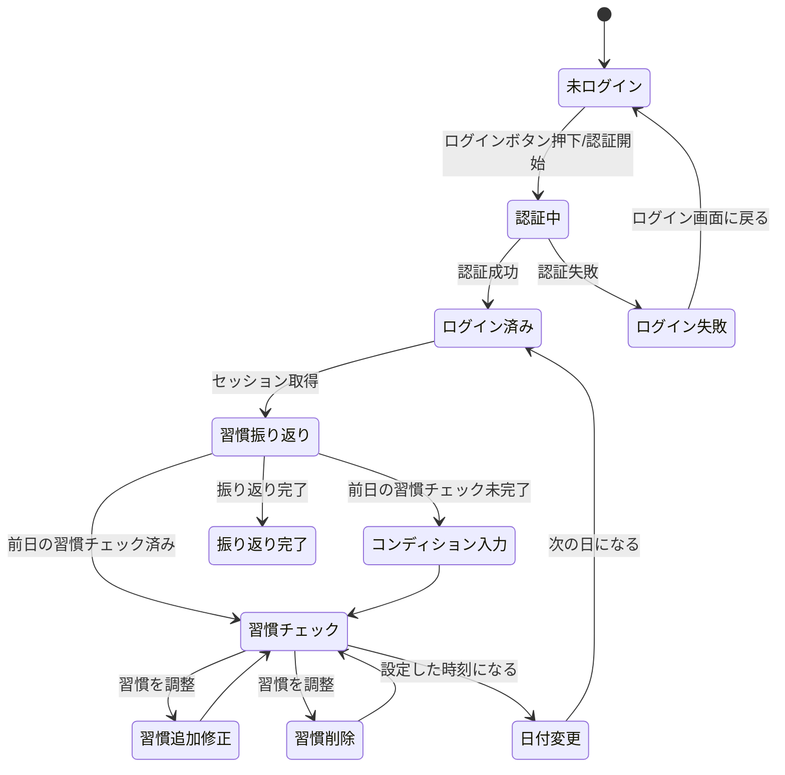

# 状態遷移図

```mermaid
stateDiagram-v2
    [*] --> 未ログイン
    未ログイン --> 認証中 : ログインボタン押下/認証開始
    認証中 --> ログイン済み : 認証成功
    認証中 --> ログイン失敗 : 認証失敗
    ログイン失敗 --> 未ログイン : ログイン画面に戻る
    ログイン済み --> 習慣振り返り : セッション取得
    習慣振り返り --> コンディション入力 : 前日の習慣チェック未完了
    習慣振り返り --> 習慣チェック : 前日の習慣チェック済み
    習慣振り返り --> 振り返り完了 : 振り返り完了
    コンディション入力 --> 習慣チェック
    習慣チェック --> 習慣追加修正 : 習慣を調整
    習慣チェック --> 習慣削除 : 習慣を調整
    習慣追加修正 --> 習慣チェック
    習慣削除 --> 習慣チェック
    習慣チェック --> 日付変更 : 設定した時刻になる
    日付変更 --> ログイン済み : 次の日になる
```

