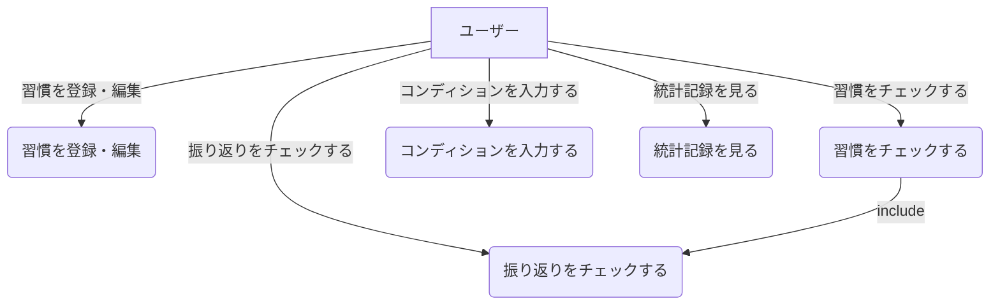

# ユースケース図

```mermaid
graph TD
  User[ユーザー]
  User -- 習慣を登録・編集 --> UC1(習慣を登録・編集)
  User -- 習慣をチェックする --> UC2(習慣をチェックする)
  User -- コンディションを入力する --> UC3(コンディションを入力する)
  User -- 振り返りをチェックする --> UC4(振り返りをチェックする)
  User -- 統計記録を見る --> UC5(統計記録を見る)
  UC2 -- include --> UC4
```

## ユースケース一覧
- 習慣を登録・編集
- 習慣をチェックする
- コンディションを入力する
- 振り返りをチェックする
- 統計記録を見る

